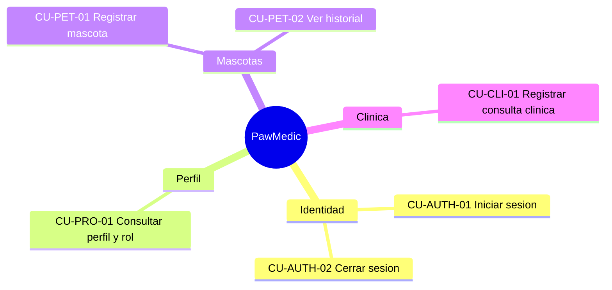

# Catalogo de features (FDD)

> Documento de bootstrap. No existia un catalogo en el repositorio inicial;
> estas fichas son supuestos de planificacion y requieren validacion.

## Feature map

## FDD-01 Identidad y sesion

* **Objetivo:** permitir que una persona acceda con una cuenta autenticada.
* **Entrada:** email y password.
* **Salida:** sesion, token de acceso y perfil asociado.
* **Reglas:** campos obligatorios; el token no se persiste en texto plano por
  la capa de UI; el cierre de sesion invalida el estado local.
* **Estado:** scaffold implementado con puerto Supabase y repositorio de test.

## FDD-02 Perfil y rol

* **Objetivo:** resolver nombre, email y rol para dirigir la experiencia.
* **Roles iniciales:** `USER`, `VETERINARY_BUSINESS`, `SUPERADMIN`.
* **Reglas:** el rol de UI no reemplaza las politicas RLS.
* **Estado:** scaffold implementado con `StateFlow`.

## FDD-03 Mascotas

* **Objetivo:** registrar identidad basica de una mascota.
* **Campos supuestos:** nombre, especie, raza opcional, fecha de nacimiento
  opcional, peso y notas.
* **Estado:** planificado; requiere decisiones sobre unidades y consentimiento.

## FDD-04 Consulta clinica

* **Objetivo:** guardar una nota clinica vinculada a una mascota.
* **Campos supuestos:** motivo, observaciones, diagnostico, plan y fecha.
* **Estado:** contrato de caso de uso en `CU-CLI-01...`; implementacion futura.

## Definition of done transversal

Automated unit tests for domain rules, loading/error/empty states, RLS
policies reviewed, audit events defined, accessible Compose UI, and no
credentials in source control.
