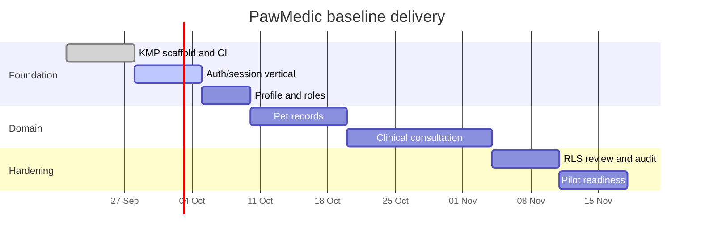

# Cronograma de features

> Baseline estimado creado porque no habia cronograma original. Dates are
> placeholders until product and clinical stakeholders approve scope.

## Milestones

| Milestone | Exit criteria | Dependency |
| --- | --- | --- |
| Foundation | Modules build and tests run | JDK/Android SDK |
| Identity | Sign in, sign out, session restore, role loading | Supabase project |
| Records | Pet CRUD and owner authorization | Identity |
| Clinical | Consultation create/read with audit trail | Records, clinical review |
| Pilot | Observability, backup, threat model, support runbook | All above |

This is not a commitment to dates. Update this document after validating the
missing product source documents.
