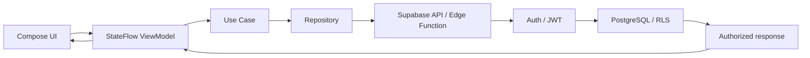

# Architecture



Each feature follows a vertical layout:

```text
shared/features/<name>/src/commonMain/kotlin/com/pawsmedic/features/<name>/
  data/          adapters and DTOs
  domain/        models and use cases
  presentation/ state holders for Compose
```

Domain ports live in each feature's `domain/repository` package, so UI tests
and local previews can use in-memory implementations without importing a
backend SDK.
