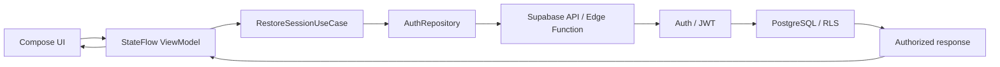

# Authenticated request flow

The same sequence is used by Android and desktop. UI routing maps
`USER` to the user app, `VETERINARY_BUSINESS` to the veterinary tenant
dashboard, and `SUPERADMIN` to the platform administration dashboard.
