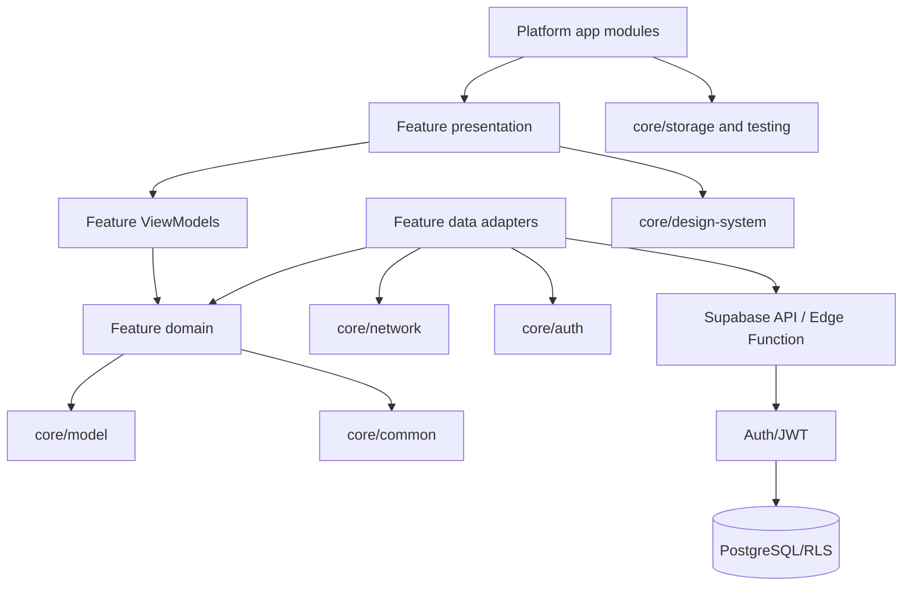

# Module dependencies

Arrows point from a consumer to a dependency. Feature domain code does not
depend on Compose, Supabase SDK types, or another feature's data layer.
`settings.gradle.kts` is the authoritative list of modules.
