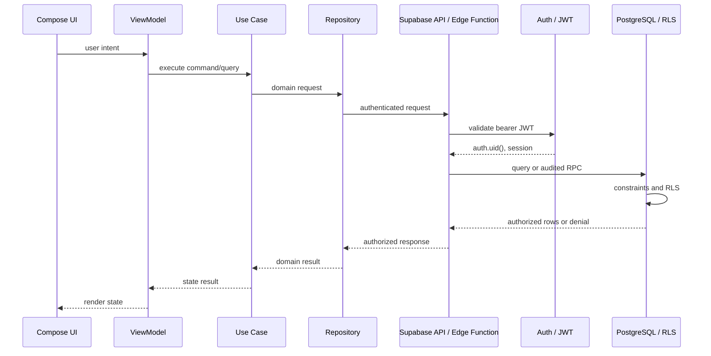

# Request flow

```mermaid
sequenceDiagram
    participant UI as Compose UI
    participant VM as ViewModel
    participant UC as Use Case
    participant Repo as Repository
    participant API as Supabase API / Edge Function
    participant Auth as Auth / JWT
    participant DB as PostgreSQL / RLS

    UI->>VM: user intent
    VM->>UC: execute command/query
    UC->>Repo: domain request
    Repo->>API: authenticated request
    API->>Auth: validate bearer JWT
    Auth-->>API: auth.uid(), session
    API->>DB: query or audited RPC
    DB->>DB: constraints and RLS
    DB-->>API: authorized rows or denial
    API-->>Repo: authorized response
    Repo-->>UC: domain result
    UC-->>VM: state result
    VM-->>UI: render state
```

The service-role credential, when required by an Edge Function, remains
server-side. RLS is still the final data boundary.
