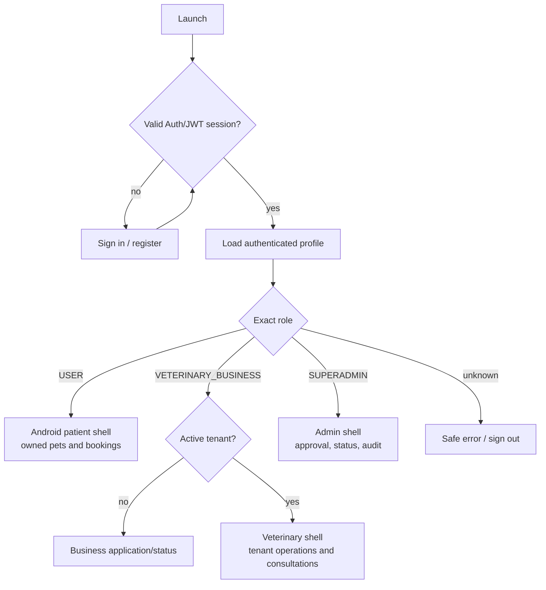

# Role navigation

Routing selects a UI shell only. Each destination still follows **UI ->
ViewModel -> Use Case -> Repository -> Supabase API/Edge Function -> Auth/JWT
-> PostgreSQL/RLS -> authorized response**.
