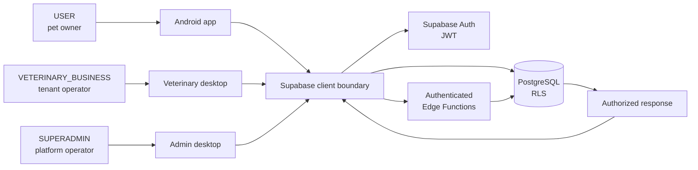

# System context

The three roles use separate app shells, but all data access carries the same
Auth/JWT identity and is filtered by PostgreSQL/RLS. The service-role key is
never present in a client.
